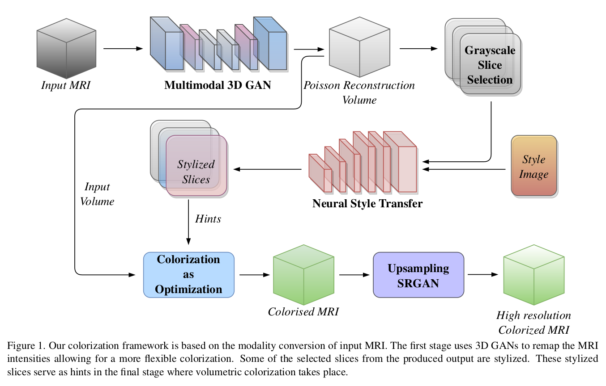
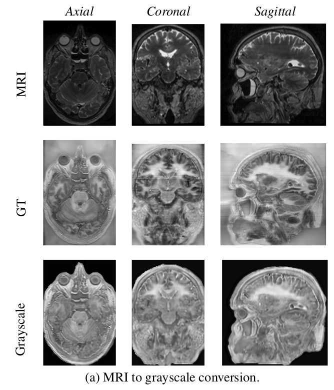
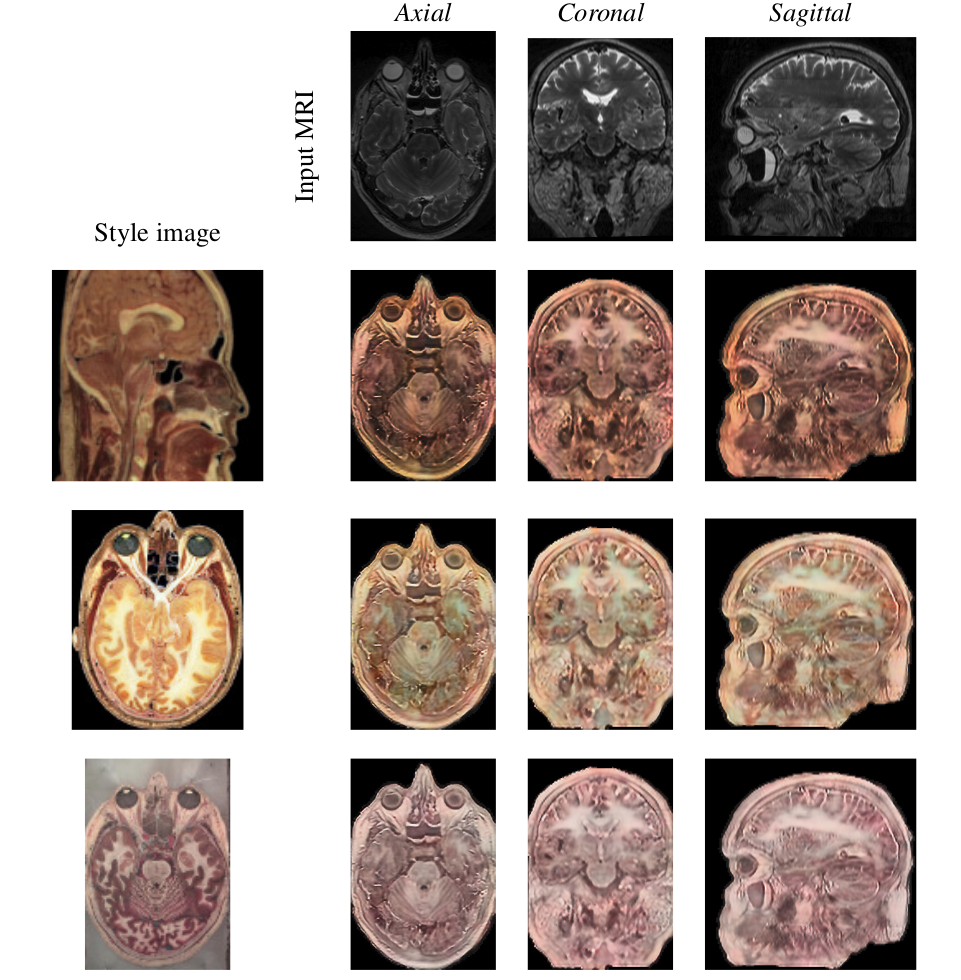
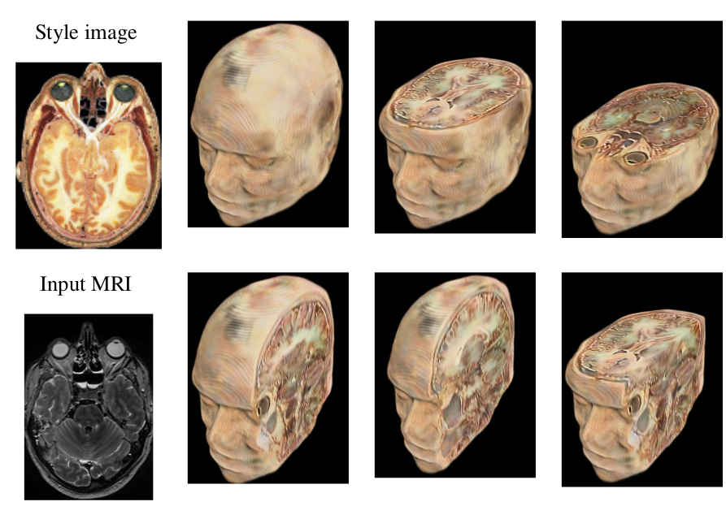

# 2D-To-3D-Medical-Image-Colorization
Colorization involves the synthesis of colors while preserving structural content as well as the semantics of the target image. This problem has been well studied for 2D photographs with many state-of-the-art solutions. We explore a new challenge in the field of colorization where we aim at colorizing multi-modal 3D medical data using 2D style exemplars. To the best of our knowledge, this work is the first of its kind and poses challenges related to the modality (medical MRI) and dimensionality (3D volumetric images) of the data. Our approach to colorization is motivated by modality conversion that highlights its robustness in handling multi-modal data.

## Generator Weights
The weights for the generator can be downloaded from here: [https://drive.google.com/drive/folders/1PafPje7Qus5SC4tXb1WzaiaNmhuIj8Pc?usp=sharing](https://drive.google.com/drive/folders/1PafPje7Qus5SC4tXb1WzaiaNmhuIj8Pc?usp=sharing)

The above link also shows the generated colorized volumes and their masks for different MRI volume and different styles.

## Complete Pipeline
The following is the our proposed novel pipeline for synthesis of high resolution colorized volume for an inpput MRI volume:

## GAN Synthesis Results
The following are the results of the trained generator on 16-bit Visible Human 2 MRI volume

## Results of the Complete Pipeline
The following are the results of the complete pipeline for different style images:

## 3D Rendering
The 3D rendering of one of the generated volume using Inviwo renderer.

## TODOs
- [ ] Share code for poisson reconstruction
- [ ] Provide the code for SRGAN module and weights for the trained model.
- [ ] Provide some test volumes for results generation.
- [ ] Share all the generated volmes and their masks via the drive link.

